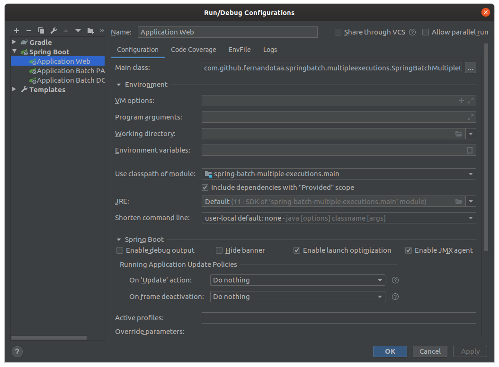
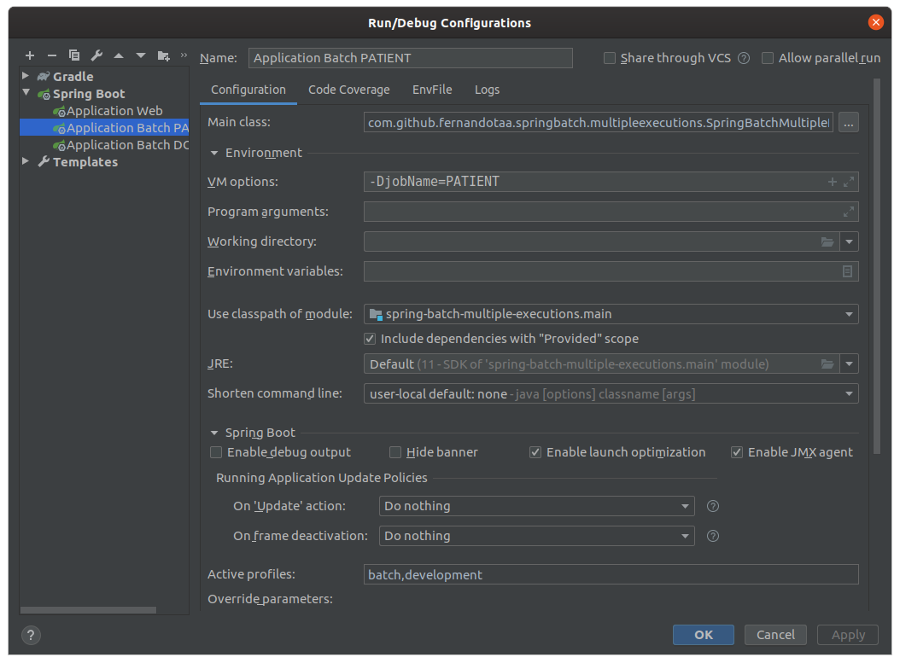
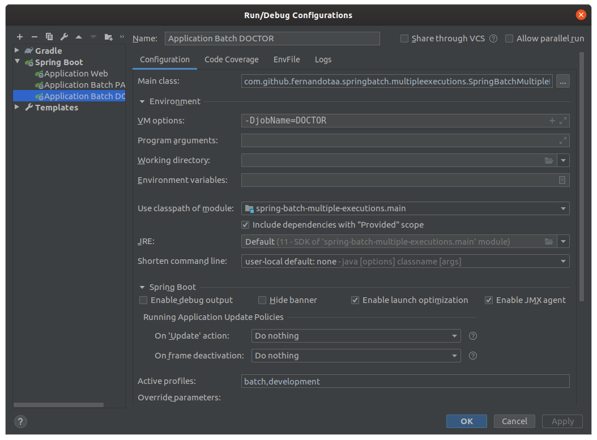

# spring-batch-multiple-executions

This is a sample projet to prove that is possible the use of multiple executions using Spring Batch and Spring Boot with WEB starter at the same code.

## Executions

### Using docker-compose

#### Web Application

##### Start

```shell script
./devops$ docker-compose -f docker-compose.structure.yml -f docker-compose.web.yml up
```

##### Stop

```shell script
./devops$ docker-compose -f docker-compose.structure.yml -f docker-compose.web.yml down
```

#### Batch Application - Job Name: PATIENT

##### Start

```shell script
./devops$ docker-compose -f docker-compose.structure.yml -f docker-compose.batch-patient.yml up
```

##### Stop

```shell script
./devops$ docker-compose -f docker-compose.structure.yml -f docker-compose.batch-patient.yml down
```

#### Batch Application - Job Name: DOCTOR

##### Start

```shell script
./devops$ docker-compose -f docker-compose.structure.yml -f docker-compose.batch-doctor.yml up
```

##### Stop

```shell script
./devops$ docker-compose -f docker-compose.structure.yml -f docker-compose.batch-doctor.yml down
```

### Using Intellij

Make sure it is running a PostgreSQL instance.
It is possible run the follow command before to start a PostgreSQL container

```shell script
./devops$ docker-compose -f docker-compose.structure.yml up
```

#### Web Application



#### Batch Application - Job Name: PATIENT



#### Batch Application - Job Name: DOCTOR

